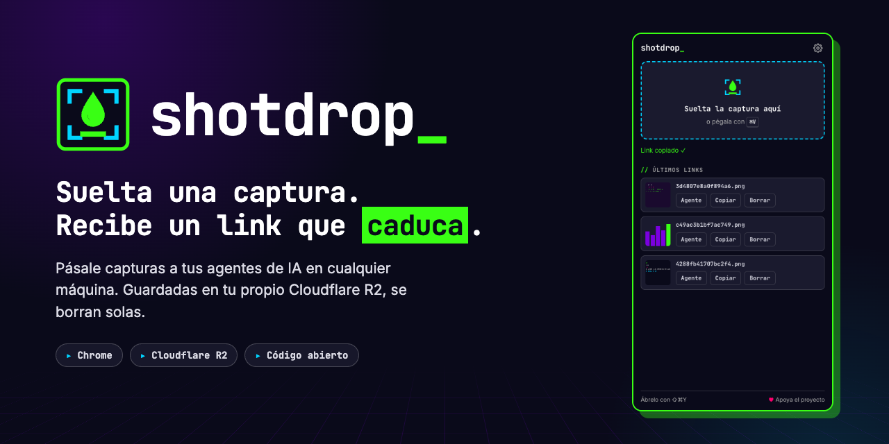
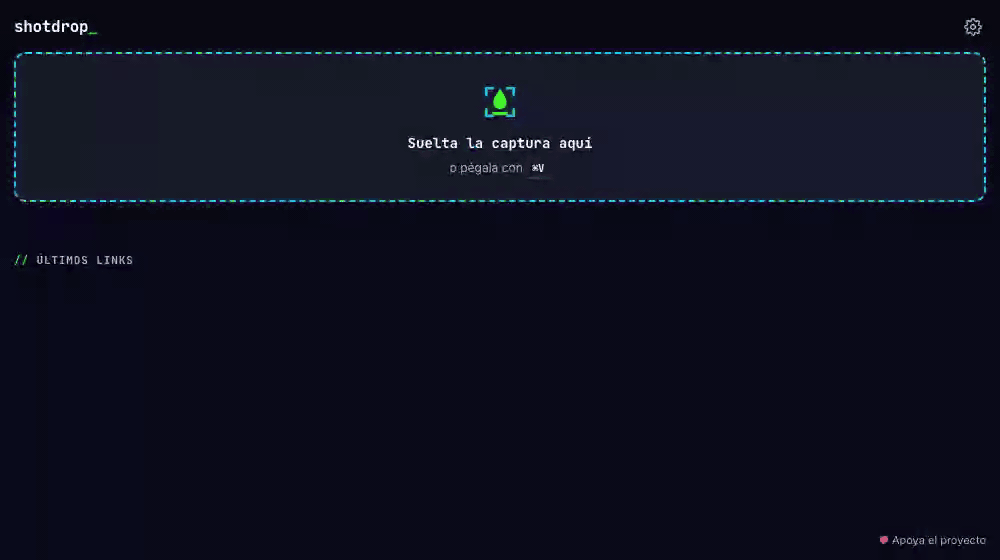
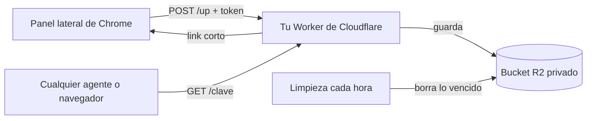

<p align="center">
  
</p>

<p align="center">
  <a href="https://github.com/ctala/shotdrop/actions/workflows/ci.yml"></a>
  <a href="LICENSE"></a>
  
  
  
  <a href="https://github.com/sponsors/ctala"></a>
</p>

<p align="center">
  <a href="README.md">English</a> · <b>Español</b> ·
  <a href="#inicio-rápido">Inicio rápido</a> ·
  <a href="#para-agentes-de-ia">Para agentes de IA</a> ·
  <a href="#seguridad">Seguridad</a>
</p>

---

**shotdrop** es un panel lateral de Chrome: sueltas una captura y te devuelve un link corto, ya copiado en tu portapapeles. La imagen queda en **tu propio bucket de Cloudflare R2** y se borra sola a los 7 días, o en el momento en que aprietas borrar.

Nació para una tarea concreta: pasarle capturas a agentes de programación con IA (Claude Code, Codex, Aider…) que corren en una terminal en otra máquina, por SSH o en la nube, donde no se puede pegar una imagen. En vez de la imagen pegas un link, y el agente la descarga.

<p align="center">
  
</p>

## Qué hace

- **Suelta o pega.** Arrastra una captura al panel lateral o pégala con <kbd>⌘</kbd><kbd>V</kbd> / <kbd>Ctrl</kbd><kbd>V</kbd>. El link queda copiado.
- **Un clic para agentes.** El botón **Agente** copia una instrucción lista para pegar: *descárgala con `curl` y léela*.
- **Links que caducan.** Siete días por defecto (configurable), y lo aplica el servidor. **Borrar** mata un link al instante.
- **Tu almacenamiento.** Un bucket privado de R2 en tu cuenta de Cloudflare, servido por tu propio Worker. Sin terceros de por medio.
- **Sin rastreo.** Sin analítica, sin fuentes remotas, sin pedidos a nadie más que a tu servidor.
- **Atajo de teclado.** <kbd>⌘</kbd><kbd>⇧</kbd><kbd>Y</kbd> en macOS, <kbd>Ctrl</kbd><kbd>Shift</kbd><kbd>Y</kbd> en el resto. Se cambia en `chrome://extensions/shortcuts`.
- **En español e inglés**, según el idioma de tu navegador.

## Inicio rápido

Necesitas una cuenta de Cloudflare. Para uso personal, el servidor cabe de sobra en los planes gratis de [Workers](https://developers.cloudflare.com/workers/platform/pricing/) y [R2](https://developers.cloudflare.com/r2/pricing/). R2 hay que activarlo una vez en el panel, y Cloudflare puede pedir un medio de pago para hacerlo.

### 1. Despliega tu servidor

[](https://deploy.workers.cloudflare.com/?url=https://github.com/ctala/shotdrop/tree/main/worker)

El botón crea el Worker y un bucket R2 **privado**, y pide un secreto:

| Secreto | Qué poner |
|---|---|
| `UPLOAD_TOKEN` | Un texto largo y aleatorio. Genéralo con `openssl rand -hex 24`. |

Cuando termine, abre la dirección de tu Worker (algo como `https://shotdrop.tu-cuenta.workers.dev`). Tiene que decir `shotdrop server 1.0.0 ✓ ready`.

<details>
<summary>¿Prefieres la terminal?</summary>

```bash
git clone https://github.com/ctala/shotdrop && cd shotdrop/worker
npx wrangler r2 bucket create shotdrop
npx wrangler secret put UPLOAD_TOKEN      # pega tu texto largo y aleatorio
npx wrangler deploy
```
</details>

### 2. Instala la extensión

- **Chrome Web Store:** en revisión. El link va a estar aquí apenas la aprueben.
- **Mientras tanto, desde el código:** descarga este repo, abre `chrome://extensions`, activa el **Modo de desarrollador**, haz clic en **Cargar descomprimida** y elige la carpeta `extension/`.

### 3. Conéctalos

La primera vez, la extensión abre su **Configuración**. Pega la dirección de tu Worker y tu `UPLOAD_TOKEN`, aprieta **Guardar** y espera el **Conectado, token válido ✓**.

Listo. Haz clic en el ícono de shotdrop (o usa el atajo) y suelta una captura.

## Uso

| Tú haces | shotdrop hace |
|---|---|
| Sueltas una imagen en el panel, o la pegas | La sube y copia el link |
| Clic en **Agente** en un link | Copia una instrucción que un agente de IA puede seguir |
| Clic en **Copiar** | Vuelve a copiar el link |
| Clic en **Borrar** y después en **¿Seguro?** | La borra de R2; el link deja de funcionar al instante |
| Esperas 7 días | El servidor la borra y el panel deja de mostrarla |

En la **Configuración** puedes hacer que cada subida copie la instrucción para el agente en vez del link solo.

## Para agentes de IA

El botón **Agente** copia esto, listo para pegar en el prompt de cualquier agente:

```text
Mira esta captura. Descárgala con `curl -so /tmp/e41b02979f927530.png https://shots.example.com/e41b02979f927530.png` y lee /tmp/e41b02979f927530.png
```

Los agentes que pueden correr comandos y leer imágenes (Claude Code, por ejemplo) siguen solos desde ahí. No hay nada que instalar en la máquina del agente: es un `curl`.

Las máquinas sin navegador también pueden subir. Es la misma llamada que hace la extensión:

```bash
curl -s -X POST https://<tu-servidor>/up \
  -H "authorization: Bearer $SHOTDROP_TOKEN" \
  -H "content-type: image/png" \
  --data-binary @captura.png
# {"url":"https://<tu-servidor>/e41b02979f927530.png","key":"e41b02979f927530.png","expiresAt":1790715195828}
```

## Cómo funciona



La extensión nunca habla con R2. Solo conoce la dirección de tu Worker y un token de subida; el Worker es el que tiene acceso al bucket. La caducidad se aplica dos veces: en cada lectura y en una limpieza cada hora, así que no hay que configurar a mano ninguna regla de ciclo de vida en R2.

<details>
<summary>API del servidor</summary>

| Método | Ruta | Autenticación | Devuelve |
|---|---|---|---|
| `POST` | `/up` | `Bearer <UPLOAD_TOKEN>` | `200 {url, key, expiresAt}` · `401 unauthorized` · `413 too_large` · `415 unsupported_type` · `503 not_configured` |
| `GET` | `/<clave>` | ninguna | la imagen, `cache-control: no-store` · `404` si se borró o caducó |
| `DELETE` | `/<clave>` | `Bearer <UPLOAD_TOKEN>` | `204` |
| `GET` | `/` | ninguna | `shotdrop server <versión> ✓ ready` |

Tipos aceptados: PNG, JPEG, WebP y GIF, hasta 25 MB. Las claves son 16 caracteres hexadecimales aleatorios (64 bits).
</details>

## Configuración

| Qué | Dónde | Por defecto |
|---|---|---|
| Cuánto vive una captura | `TTL_DAYS` en `worker/wrangler.toml` | `7` |
| Token de subida | `npx wrangler secret put UPLOAD_TOKEN` | ninguno: obligatorio |
| Tu propio dominio | agrega un bloque `[[routes]]` con `custom_domain = true` | `*.workers.dev` |
| Qué se copia al subir | **Configuración** de la extensión | el link |

## Seguridad

- **El navegador nunca tiene tus credenciales de R2.** La extensión guarda solo la dirección del servidor y el token de subida, en `chrome.storage.local`.
- **El token sirve para subir y borrar, nada más.** Si se filtra, corre `npx wrangler secret put UPLOAD_TOKEN` con un valor nuevo y pégalo en la Configuración. El anterior deja de funcionar en ese momento.
- **El bucket es privado.** Las imágenes solo se sirven a través del Worker, y solo por su clave imposible de adivinar.
- **Los links no están listados, pero no son secretos.** Cualquiera que tenga un link puede abrirlo hasta que caduque. No subas nada que no pegarías en un chat, y usa **Borrar** si te equivocas.
- **El token nunca viaja sin cifrar.** La extensión pasa `http://` a `https://` (solo `localhost` queda en http, para desarrollo).
- **Permisos mínimos:** `storage`, `sidePanel` y `clipboardWrite`. Sin permisos de host, sin scripts de contenido, sin acceso a las páginas que visitas.

¿Encontraste una vulnerabilidad? Repórtala en privado: ver [SECURITY.md](SECURITY.md).

## Privacidad

shotdrop no recolecta nada. Sin analítica, sin telemetría, sin pedidos a terceros: las imágenes van directo de tu navegador a tu servidor. La política completa está en [PRIVACY.md](PRIVACY.md).

## Desarrollo

```bash
npm install
npx playwright install chromium   # una vez
npm test                          # tests unitarios: Worker, lógica de la extensión, traducciones
npm run test:e2e                  # la extensión real en Chromium contra un Worker local
```

La suite de punta a punta levanta `wrangler dev` con un bucket R2 simulado, así que nunca toca un servidor desplegado. El proyecto se construye con los tests primero: todo comportamiento nuevo parte como un test que falla. Ver [CONTRIBUTING.md](CONTRIBUTING.md).

## Apoya el proyecto

shotdrop es gratis y de código abierto. Si te ahorra unos minutos al día, puedes [apoyarlo en GitHub Sponsors](https://github.com/sponsors/ctala). Eso sostiene este y el resto de mi trabajo abierto.

<p><a href="https://github.com/sponsors/ctala"></a></p>

## Licencia

El código tiene [licencia MIT](LICENSE). El nombre y el logo de **shotdrop** no están cubiertos por ella: ver [TRADEMARK.md](TRADEMARK.md).

---

<p align="center">Hecho por <a href="https://cristiantala.com">Cristian Tala</a></p>
