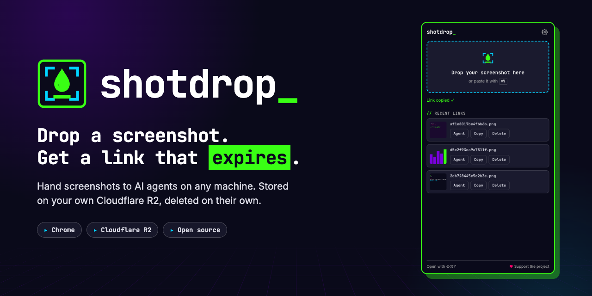
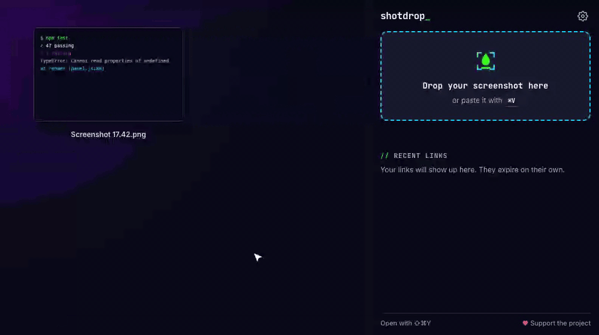
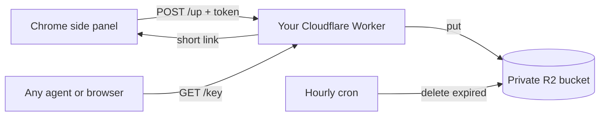

<p align="center">
  
</p>

<p align="center">
  <a href="https://github.com/ctala/shotdrop/actions/workflows/ci.yml"></a>
  <a href="LICENSE"></a>
  
  
  
  <a href="https://github.com/sponsors/ctala"></a>
</p>

<p align="center">
  <b>English</b> · <a href="README.es.md">Español</a> ·
  <a href="#quick-start">Quick start</a> ·
  <a href="#for-ai-agents">For AI agents</a> ·
  <a href="#security">Security</a>
</p>

---

**shotdrop** is a Chrome side panel where you drop a screenshot and get a short link back, already in your clipboard. The image lives in **your own Cloudflare R2** bucket and deletes itself after 7 days, or the moment you press delete.

It was built for one job: handing screenshots to AI coding agents (Claude Code, Codex, Aider…) that run in a terminal on another machine, over SSH or in the cloud, where you can't paste an image. You paste a link instead, and the agent downloads it.

<p align="center">
  
</p>

## Features

- **Drop or paste.** Drag a screenshot into the side panel, or paste it with <kbd>⌘</kbd><kbd>V</kbd> / <kbd>Ctrl</kbd><kbd>V</kbd>. The link is copied.
- **One click for agents.** The **Agent** button copies a ready-to-paste instruction: *download it with `curl` and read it*.
- **Links that expire.** Seven days by default (configurable), enforced by the server. **Delete** kills a link instantly.
- **Your storage.** A private R2 bucket in your Cloudflare account, served through your own Worker. No third party in between.
- **No tracking.** No analytics, no remote fonts, no requests to anyone but your server.
- **Keyboard shortcut.** <kbd>⌘</kbd><kbd>⇧</kbd><kbd>Y</kbd> on macOS, <kbd>Ctrl</kbd><kbd>Shift</kbd><kbd>Y</kbd> elsewhere. Change it in `chrome://extensions/shortcuts`.
- **English and Spanish**, following your browser's language.

## Quick start

You need a Cloudflare account. For personal use the server fits comfortably in the free tiers of [Workers](https://developers.cloudflare.com/workers/platform/pricing/) and [R2](https://developers.cloudflare.com/r2/pricing/). R2 has to be enabled once in your dashboard, and Cloudflare may ask for a payment method to do it.

### 1. Deploy your server

[](https://deploy.workers.cloudflare.com/?url=https://github.com/ctala/shotdrop/tree/main/worker)

The button creates the Worker and a **private** R2 bucket, and asks for one secret:

| Secret | What to put |
|---|---|
| `UPLOAD_TOKEN` | A long random string. Generate one with `openssl rand -hex 24`. |

When it finishes, open your Worker's URL (something like `https://shotdrop.your-account.workers.dev`). It should say `shotdrop server 1.0.0 ✓ ready`.

<details>
<summary>Prefer the command line?</summary>

```bash
git clone https://github.com/ctala/shotdrop && cd shotdrop/worker
npx wrangler r2 bucket create shotdrop
npx wrangler secret put UPLOAD_TOKEN      # paste your long random string
npx wrangler deploy
```
</details>

### 2. Install the extension

- **Chrome Web Store:** in review. The link will be here as soon as it is approved.
- **Meanwhile, from source:** download this repo, open `chrome://extensions`, turn on **Developer mode**, click **Load unpacked** and pick the `extension/` folder.

### 3. Connect them

The extension opens its **Settings** the first time. Paste your Worker URL and your `UPLOAD_TOKEN`, press **Save**, and wait for **Connected, token valid ✓**.

That's it. Click the shotdrop icon (or press the shortcut) and drop a screenshot.

## Usage

| You do | shotdrop does |
|---|---|
| Drop an image on the panel, or paste it | Uploads it and copies the link |
| Click **Agent** on a link | Copies an instruction an AI agent can follow |
| Click **Copy** | Copies the link again |
| Click **Delete**, then **Sure?** | Deletes it from R2; the link stops working right away |
| Wait 7 days | The server deletes it and the panel stops showing it |

In **Settings** you can make every upload copy the agent instruction instead of the bare link.

## For AI agents

The **Agent** button copies this, ready to paste into any agent's prompt:

```text
Look at this screenshot. Download it with `curl -so /tmp/e41b02979f927530.png https://shots.example.com/e41b02979f927530.png` and read /tmp/e41b02979f927530.png
```

Agents that can run shell commands and read image files (Claude Code, for instance) take it from there. Nothing to install on the agent's machine: it is one `curl`.

Machines without a browser can upload too, with the same call the extension makes:

```bash
curl -s -X POST https://<your-server>/up \
  -H "authorization: Bearer $SHOTDROP_TOKEN" \
  -H "content-type: image/png" \
  --data-binary @screenshot.png
# {"url":"https://<your-server>/e41b02979f927530.png","key":"e41b02979f927530.png","expiresAt":1790715195828}
```

## How it works



The extension never talks to R2. It only knows your Worker's URL and an upload token; the Worker holds the bucket binding. Expiry is enforced twice, on every read and by an hourly cleanup, so there is no R2 lifecycle rule to set up by hand.

<details>
<summary>Server API</summary>

| Method | Path | Auth | Returns |
|---|---|---|---|
| `POST` | `/up` | `Bearer <UPLOAD_TOKEN>` | `200 {url, key, expiresAt}` · `401 unauthorized` · `413 too_large` · `415 unsupported_type` · `503 not_configured` |
| `GET` | `/<key>` | none | the image, `cache-control: no-store` · `404` if deleted or expired |
| `DELETE` | `/<key>` | `Bearer <UPLOAD_TOKEN>` | `204` |
| `GET` | `/` | none | `shotdrop server <version> ✓ ready` |

Accepted types: PNG, JPEG, WebP and GIF, up to 25 MB. Keys are 16 random hex characters (64 bits).
</details>

## Configuration

| Setting | Where | Default |
|---|---|---|
| How long a screenshot lives | `TTL_DAYS` in `worker/wrangler.toml` | `7` |
| Upload token | `npx wrangler secret put UPLOAD_TOKEN` | none: required |
| Your own domain | add a `[[routes]]` block with `custom_domain = true` | `*.workers.dev` |
| What gets copied after an upload | extension **Settings** | the link |

## Security

- **The browser never holds your R2 credentials.** The extension stores only the server URL and the upload token, in `chrome.storage.local`.
- **The token can upload and delete, nothing else.** If it leaks, run `npx wrangler secret put UPLOAD_TOKEN` with a new value and paste it in Settings. The old one stops working at once.
- **The bucket is private.** Images are served only through the Worker, and only by their unguessable key.
- **Links are unlisted, not secret.** Anyone with a link can open it until it expires. Don't upload anything you wouldn't paste in a chat, and use **Delete** when you slip.
- **The token never travels in clear text.** The extension upgrades `http://` to `https://` (only `localhost` stays on http, for development).
- **Minimal permissions:** `storage`, `sidePanel` and `clipboardWrite`. No host permissions, no content scripts, no access to the pages you visit.

Found a vulnerability? Please report it privately: see [SECURITY.md](SECURITY.md).

## Privacy

shotdrop collects nothing. No analytics, no telemetry, no third-party requests: images go straight from your browser to your server. Full policy in [PRIVACY.md](PRIVACY.md).

## Development

```bash
npm install
npx playwright install chromium   # once
npm test                          # unit tests: Worker, extension logic, translations
npm run test:e2e                  # the real extension in Chromium against a local Worker
```

The end-to-end suite starts `wrangler dev` with a simulated R2 bucket, so it never touches a deployed server. The project is built test-first: new behavior starts as a failing test. See [CONTRIBUTING.md](CONTRIBUTING.md).

<details>
<summary>Project layout</summary>

```text
extension/        Chrome extension (Manifest V3): side panel, settings, i18n
worker/           Cloudflare Worker: upload, serve, delete, hourly cleanup
tests/unit/       Worker contract and extension logic (node:test, no network)
tests/e2e/        The real extension in Chromium against wrangler dev
assets/src/       Logo, hero, Store images and demo GIF, all rendered from HTML
store/            Chrome Web Store listing and images
```
</details>

## Support the project

shotdrop is free and open source. If it saves you a few minutes a day, you can [sponsor it on GitHub](https://github.com/sponsors/ctala). That keeps this and the rest of my open work going.

<p><a href="https://github.com/sponsors/ctala"></a></p>

## License

Code under the [MIT license](LICENSE). The **shotdrop** name and logo are not covered by it: please don't use them for a fork or a derivative product.

---

<p align="center">Made by <a href="https://cristiantala.com">Cristian Tala</a></p>
